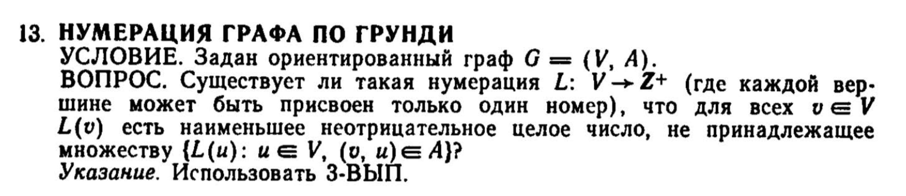
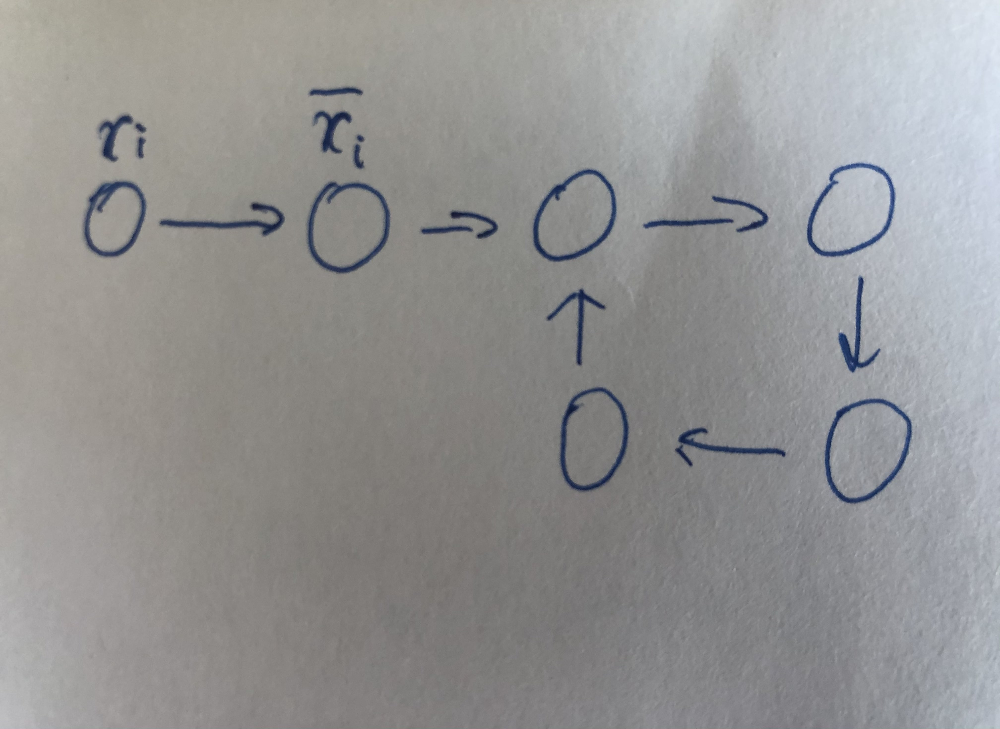
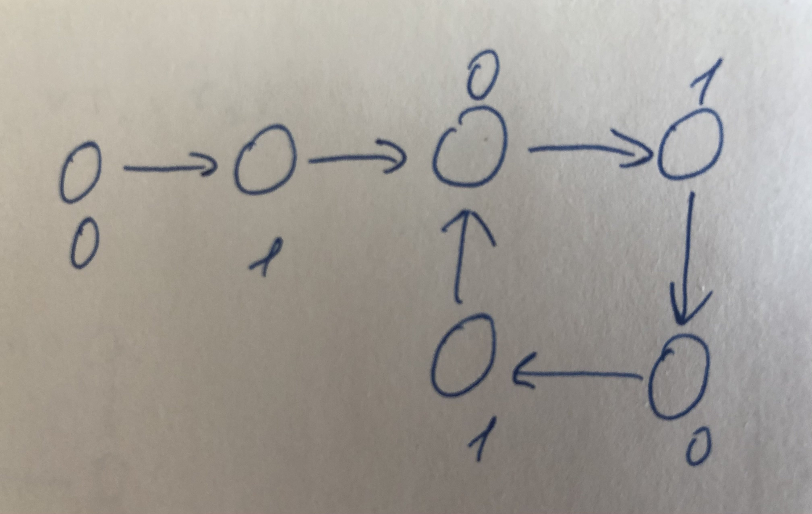
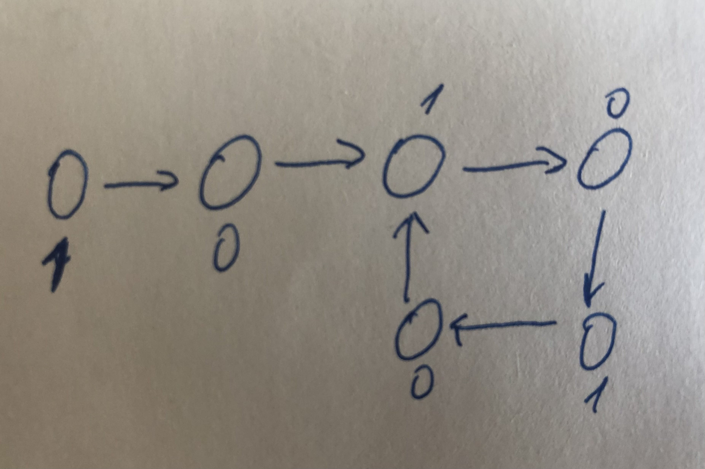
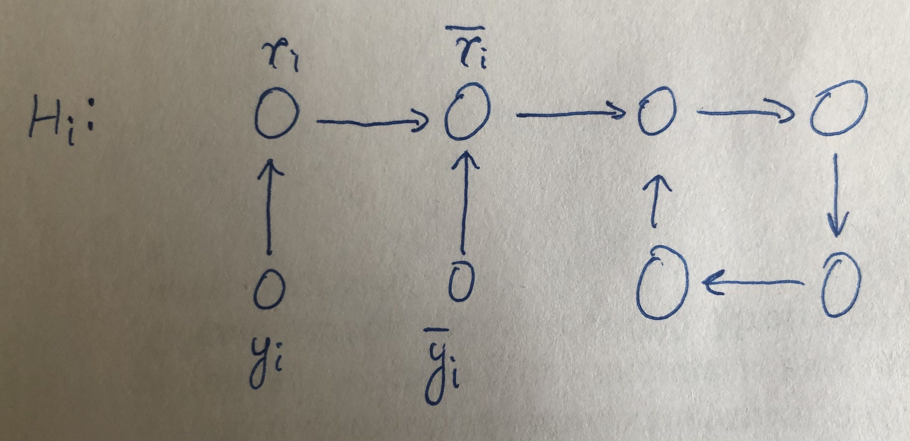
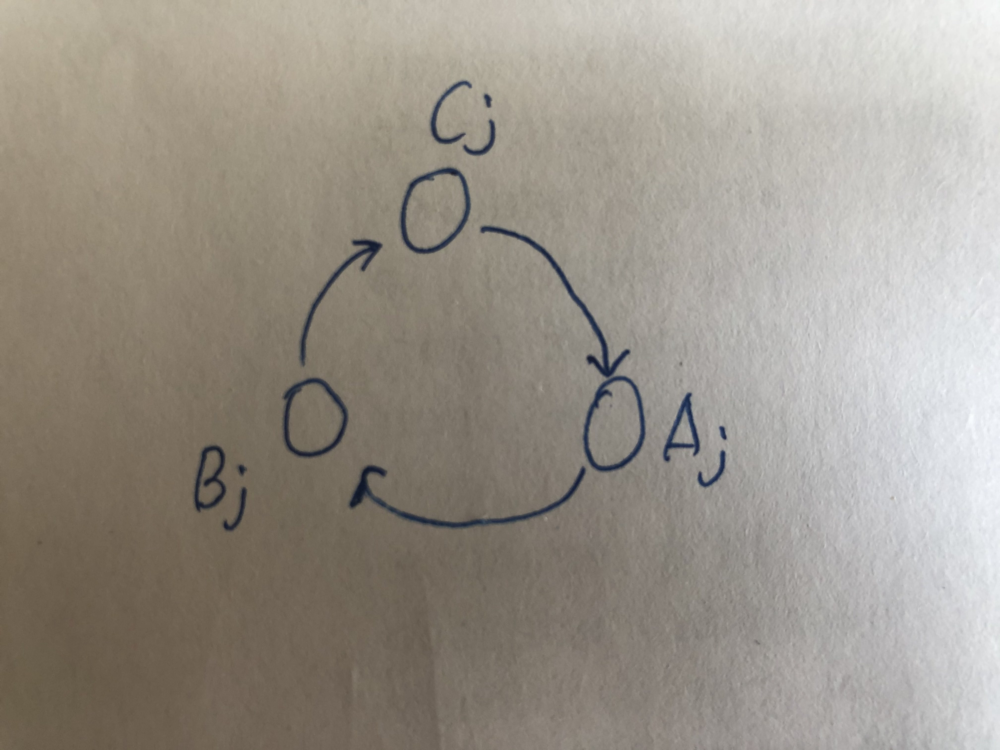
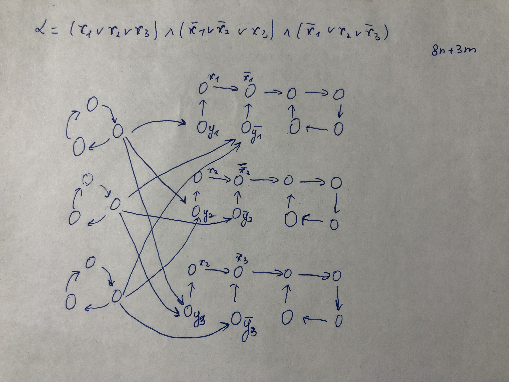
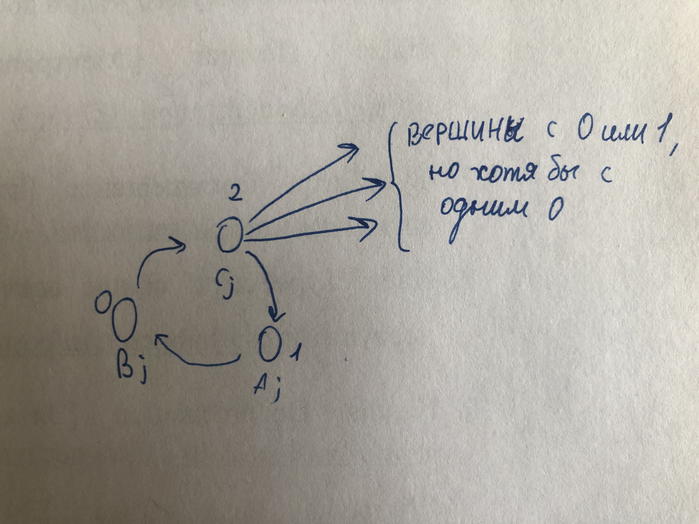

1) Граф можно обойти и проверить за полиномиальное время => задача нумерации по Гранди принадлежит NP.
2) Сведем **3SAT** к нумерации по **Гранди**.
Пусть у нас есть 3SAT булева формула **a** с **m** дизъюнкциями и **n** различными переменными. Пример построения графа **G** такого, что **a** выполняется тогда и только тогда, когда для графа **G** существует раскраска Гранди (**i** ∈ [1, n]):

Рассмотрим этот граф. Единственные возможные раскраски Гранди для этого графа:

Далее в следующих построениях дополним граф **H**i переменными **y**i и **!yi** для присвоения истинного значения для **x**i:

Чтобы показать, что **3SAT** сводится к раскраске **Гранди**, изобразим подграфы **H**i, i ∈ [1, n]. Для каждой дизъюнкции **C**j, j ∈ [1, m] изобразим подграф:

Проведем ребро из **C**j к каждой **y**i и **!y**i.

Каждая дизъюнкция должна содержать хотя бы один true литерал (**x**i или **!x**i). И, следовательно, **C**j должна быть соединеная с **y**i или **!y**i в **G**, которые имеют значения 0 или 1:

Так как **C**j соединена с **y**i и **!y**i, которые имеют значения 0 и 1, то **g**(**C**j) = 2, **g**(**B**i) = 0, **g**(**A**i) = 1. Решение 3SAT существует => существует раскраска **Гранди**.
Доказательство в обратну сторону от противного. Пусть у нас не существует решения 3SAT. Значит, **C**j соединена с **y**i и **!y**i, каждая из которых имеет значение 1. Начнем с вершины **A**j.
Есть 2 исчерпывающих случая для номера **A**j: Когда **g**(**A**j) = 0 и **g**(**A**j) >= 1.
1) **g**(**A**j) = 0: **g**(**C**j) = 2, тогда **g**(**B**j) = 0. Получаем противоречие.
2) **g**(**A**j) >= 1: **g**(**C**j) = 0, тогда **g**(**B**j) = 1. Получается, должно быть **g**(**B**j) = 0. Получаем противоречие.
