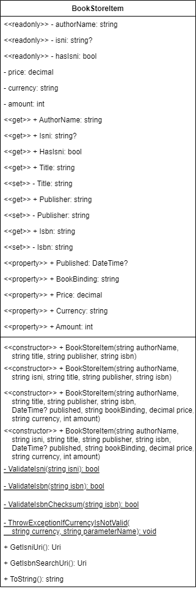

# Book Store Item

Beginner level task for practicing object-oriented design and class declaration.

Before starting with the task learn the basics of [UML language](https://en.wikipedia.org/wiki/Unified_Modeling_Language) and [UML Class Diagrams](https://en.wikipedia.org/wiki/Class_diagram). Search YouTube for [relevant video tutorials](https://www.youtube.com/results?search_query=uml+class+diagram) to get started quickly. Don't waste time! You don't have to master class diagrams. You just need to get a [basic understanding on the topic](https://www.tutorialspoint.com/object_oriented_analysis_design/ooad_uml_basic_notation.htm), and you can always find the answer to your question in the [UML Class Diagrams Reference](https://www.uml-diagrams.org/class-reference.html).

Estimated time to complete the task - 1h.

The task requires .NET 6 SDK installed.


## Task Description

In this task you have to implement a class that represents a bookstore item. Each bookstore item has ten attributes:
* A name of a book author.
* An [International Standard Name Identifier (ISNI)](https://en.wikipedia.org/wiki/International_Standard_Name_Identifier) that uniquely identifies a book author.
* A book title.
* A name of a publisher who published a book.
* A book publication date.
* An [International Standard Book Number (ISBN)](https://en.wikipedia.org/wiki/ISBN) that uniquely identifies a publication.
* A book binding type.
* A book price.
* A currency of a book price.
* An amount of available books in a store.

The attributes can be read-only, optional and validatable:
* If an attribute is read-only, it is not possible to change the attribute value after an object is instantiated.
* If an attribute is optional, it is possible to omit the attribute value when an object is instantiated.
* If an attribute is validatable, an object must validate the attribute value before assigning this value to the attribute.

| Attribute        | Is read-only? | Is optional? | Is validatable? |
|------------------|---------------|--------------|-----------------|
| Authors name     | Yes           | No           | Yes             |
| Authors ISNI     | Yes           | Yes          | Yes             |
| Title            | No            | No           | Yes             |
| Publisher        | No            | No           | Yes             |
| Publication date | No            | Yes          | No              |
| ISBN             | No            | No           | Yes             |
| Binding type     | No            | No           | No              |
| Price            | No            | No           | Yes             |
| Currency         | No            | No           | Yes             |
| Amount           | No            | No           | Yes             |

Possible design of the class is shown on the class diagram below.




### Validation Rules

A book author name, a book title and a book publisher attributes must have at least one letter character.

A valid ISNI attribute must follow these rules:
* An ISNI code string must have sixteen characters.
* Each character is either a digit or "X" character (represents 10).

A valid ISBN attribute must follow these rules:
* An ISBN code string must have ten characters.
* Each character is either a digit or "X" character (represents 10).
* An [ISBN-10 checksum](https://en.wikipedia.org/wiki/ISBN#ISBN-10_check_digits) is valid.

To calculate the ISBN-10 checksum, use this formula:

$`checksum = \sum_{i=1}^{10}(11-i)x_i=x_1·10+x_2·9+x_3·8+x_4·7+x_5·6+x_6·5+x_7·4+x_8·3+x_9·2+x_{10}·1`$,

where $`x_i`$ is the *i*th digit.

If the `checksum % 11` equals 0, then the given ISBN code is valid.

The currency attribute must follow these rules:
* A currency string must have three characters.
* Each character is a letter.

The price and amount attributes are valid, if an attribute value is greater or equals zero.


### Nullable Context

The [nullable annotation and warning contexts](https://docs.microsoft.com/en-us/dotnet/csharp/nullable-references#nullable-contexts) are enabled for both [BookStoreItem](BookStoreItem/BookStoreItem.csproj) and [BookStoreItem.Tests](BookStoreItem.Tests/BookStoreItem.Tests.csproj) projects.

```xml
<Project Sdk="Microsoft.NET.Sdk">
  <PropertyGroup>
    ...
    <Nullable>enable</Nullable>
    ...
```

When a *nullable annotation context* is set to `enable`, the compiler enables all null reference analysis and all language features.
* All new nullable warnings are enabled.
* You can use the `?` suffix to declare a [nullable reference type](https://docs.microsoft.com/en-us/dotnet/csharp/nullable-references).
* All other reference type variables are non-nullable reference types.
* The [null forgiving operator](https://docs.microsoft.com/en-us/dotnet/csharp/language-reference/operators/null-forgiving) suppresses warnings for a possible assignment to `null`. See usage examples of null forgiving operator in the [unit test code file](BookStoreItem.Tests/BookStoreItemTests.cs).


### BookStoreItem Class

Implement a class that represents a bookstore item.

Add a new [public](https://docs.microsoft.com/en-us/dotnet/csharp/programming-guide/classes-and-structs/access-modifiers) class to the [BookStoreItem.cs](BookStoreItem/BookStoreItem.cs) file. The class must fulfill these requirements:
* The class must have the same name as the file name.
* Fields
    * The class must have a private [readonly](https://docs.microsoft.com/en-us/dotnet/csharp/language-reference/keywords/readonly) field `authorName` to store an author name. The field type must be `string`.
    * The class must have a private readonly field `isni` field to store an author's ISNI. The field type must be nullable `string`.
    * The class must have a private readonly field `hasIsni` field to store a Boolean value indicating that the `isni` field is set. The field type must be `bool`.
    * The class must have a private field `price` to store a book price. The field type must be `decimal`.
    * The class must have a private field `currency` to store a price currency. The field type must be `string`.
    * The class must have a private field `amount` to store an amount of books in a store. The field type must be `int`.
* Static Methods
    * The class must have the private static method `ValidateIsni` to validate the ISNI code. The method must return `true` if the `isni` method argument has a valid ISNI code.
    * The class must have the private static method `ValidateIsbn` to validate the ISBN code. The method must return `true` if the `isbn` method argument has a valid ISBN code.
    * The class must have the private static method `ValidateIsbnChecksum` to calculate a ISBN-10 checksum and validate the ISBN code. The method must return `true` if the `isbn` method argument has an ISBN code with the valid checksum.
    * The class must have the private static method `ThrowExceptionIfCurrencyIsNotValid` that must throw an exception in case the `currency` method argument is not valid.
* Property
    * The class must have the property `AuthorName` to access the `authorName` field.
    * The class must have the property `Isni` to access the `isni` field.
    * The class must have the property `HasIsni` to access the `hasIsni` field.
    * The `AuthorName`, `Isni` and `HasIsni` properties must have only the public [get accessor](https://docs.microsoft.com/en-us/dotnet/csharp/programming-guide/classes-and-structs/using-properties#the-get-accessor).
    * The class must have the [auto-implemented property](https://docs.microsoft.com/en-us/dotnet/csharp/programming-guide/classes-and-structs/auto-implemented-properties) `Title`. The property type must be `string`.
    * The class must have the auto-implemented property `Publisher`. The property type must be `string`.
    * The class must have the auto-implemented property `Isbn`. The property type must be `string`.
    * The `Title`, `Publisher` and `Isbn` properties must have only the public get and private [set accessors](https://docs.microsoft.com/en-us/dotnet/csharp/programming-guide/classes-and-structs/using-properties#the-set-accessor).
    * The class must have the auto-implemented property `Published` to access. The property type must be nullable `DateTime`.
    * The class must have the auto-implemented property `BookBinding` to access. The property type must be `string`.
    * The class must have the property `Price` to access the `price` field. The set accessor of the property must throw an `ArgumentOutOfRangeException`, if a property value is not valid.
    * The class must have the property `Currency` to access the `currency` field. The set accessor of the property must use the `ThrowExceptionIfCurrencyIsNotValid` method to throw an `ArgumentException`, if a property value is not valid.
    * The class must have the property `Amount` to access the `amount` field. The set accessor of the property must throw an `ArgumentOutOfRangeException`, if a property value is not valid.
    * The `Published`, `BookBinding`, `Price`, `Currency` and `Amount` properties must have the public get and public set accessors.
* Constructor
    * The class must have four public [constructors](https://docs.microsoft.com/en-us/dotnet/csharp/programming-guide/classes-and-structs/constructors).
    * The class must have a constructor with `authorName`, `title`, `publisher` and `isbn` parameters.
    * The class must have a constructor with `authorName`, `isni`, `title`, `publisher` and `isbn` parameters.
    * The class must have a constructor with `authorName`, `title`, `publisher`, `isbn`, `published`, `bookBinding`, `price`, `currency` and `amount` parameters.
    * The class must have a constructor with `authorName`, `isni`, `title`, `publisher`, `isbn`, `published`, `bookBinding`, `price`, `currency` and `amount` parameters.
    * The `authorName`, `isni`, `title`, `publisher`, `isbn`, `bookBinding` and `currency` parameters must have the `string` type. The `published` parameter must have the nullable `DateTime` type. The `price` parameter must have a `decimal` type. The `amount` parameter must have the `int` type.
    * The default value for `bookBinding` constructor parameter is an empty string. The default value for `currency` constructor parameter is "USD".
    * Constructors must use the `ValidateIsni` method to validate an `isni` argument.
    * Constructors must use the `ValidateIsbn` and `ValidateIsbnChecksum` methods to validate an `isbn` argument and ISBN-10 checksum.
    * Constructors must throw an `ArgumentException` if a `isni` or `isbn` argument is not valid.
    * Constructors must use the `ThrowExceptionIfCurrencyIsNotValid` methods to throw an `ArgumentException` if a `currency` argument is not valid.
    * Add a [guard clause](https://www.google.com/search?q=guard+clause) to throw an [ArgumentException](https://docs.microsoft.com/en-us/dotnet/api/system.argumentnullexception) if an `authorName`, `title` or `publisher` argument is an empty string or has only white-space characters.
    * To remove the code duplication, use the [constructor chaining](https://www.google.com/search?q=constructor+chaining+c%23) approach.
* Instance Methods
    * The class must have the `GetIsniUri` method that must return an [Uri](https://docs.microsoft.com/en-us/dotnet/api/system.uri) object that is initialized with the link to an author page on the [isni.org](https://isni.org/) website. If an ISNI is not set, the method must throw an `InvalidOperationException`.
    * The class must have the `GetIsbnSearchUri` method that must return an `Uri` object that is initialized with the link to a relevant search page on the [isbnsearch.org](https://isbnsearch.org/) website.
    * The class must override [ToString](https://docs.microsoft.com/en-us/dotnet/api/system.object.tostring) method to return the string representation of the `BookStoreItem` object.
        * If an ISNI is not set, the `ToString` method must return the [comma-separated line](https://en.wikipedia.org/wiki/Comma-separated_values) with `title`, `authorName`, `price`, `currency` and `amount` values - "Complete Stories and Poems of Edgar Allan Poe, Edgar Allan Poe, ISNI IS NOT SET, 0.00 USD, 0".
        * If an ISNI is set, the `ToString` method must return the comma-separated line with `title`, `authorName`, `isni`, `price`, `currency` and `amount` values - "Complete Stories and Poems of Edgar Allan Poe, Edgar Allan Poe, 0000000121354025, 0.00 USD, 0".
        * If a string representation of a price value contains a comma, wrap the price string with quotation marks - "\"123,456,789.12 EUR\"".
        * The `ToString` method must use invariant culture for string formatting.


### Questions

* What is the difference between the private field and the private readonly field?
* How to make a field readonly?
* Why the `authorName`, `isni` and `hasIsni` fields are declared as readonly?
* What is the class property?
* What is the difference between the public and the private set accessors?
* What is the auto-implemented property?
* Why the `AuthorName`, `Isni` and `HasIsni` properties has only a public get accessor?
* Why the `Title`, `Publisher` and `Isbn` properties has a private set accessor?
* What is the purpose of the class constructor?
* When it makes sense to use the constructor chaining approach?
* What is the purpose of the *ToString* method?
* Why do you need to override the *ToString* method in your class?
* What data type is most suitable for financial and monetary calculations? Why?
* How to declare a nullable reference type?
* What C# language operator can be used to suppress warnings for a possible assignment to `null`?

Discuss your answers with your trainer or your mentor, if you work in a regular group.
